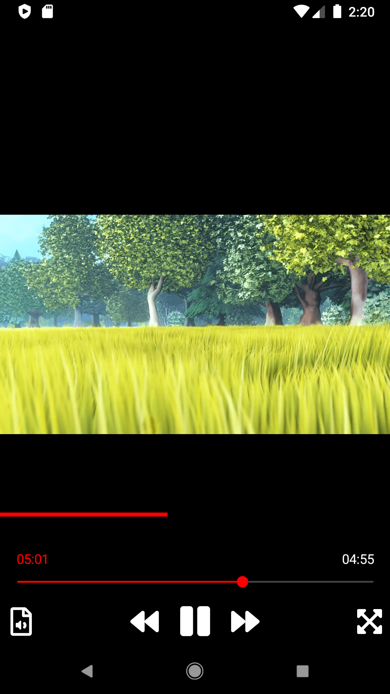

## How to use the MediaElement control ?

```xaml
<vlc:MediaPlayerElement
    EnableRendererDiscovery="True"
    LibVLC="{Binding LibVLC}"
    MediaPlayer="{Binding MediaPlayer}" />
```

Without customization, the view looks like VLC Android or iOS UI.

|  |  |
| ------------------------------------------------------------ | ------------------------------------------------------------ |

> This screenshot comes from the sample using LibVLCSharp.Forms v.3.5.1


## Customizations

- [x] Hide the Playback Controls (the Seek bar and the buttons Bar)

```xaml
<vlc:MediaPlayerElement
    EnableRendererDiscovery="True"
    LibVLC="{Binding LibVLC}"
    MediaPlayer="{Binding MediaPlayer}">
    <vlc:MediaPlayerElement.PlaybackControls>
        <vlc:PlaybackControls IsVisible="False"  />
    </vlc:MediaPlayerElement.PlaybackControls>
</vlc:MediaPlayerElement>
```


- [x] Change the Main Color

```xaml
<vlc:MediaPlayerElement
    EnableRendererDiscovery="True"
    LibVLC="{Binding LibVLC}"
    MediaPlayer="{Binding MediaPlayer}">
    <vlc:MediaPlayerElement.PlaybackControls>
        <vlc:PlaybackControls MainColor="Red"  />
    </vlc:MediaPlayerElement.PlaybackControls>
</vlc:MediaPlayerElement>
```

|  |  |
| ------------------------------------------------------------ | ------------------------------------------------------------ |

> This screenshot comes from the sample using LibVLCSharp.Forms v.3.5.1

Just type `Ctrl + Space` in the `vlc:PlaybackControls` tag to discover more customizable properties.

