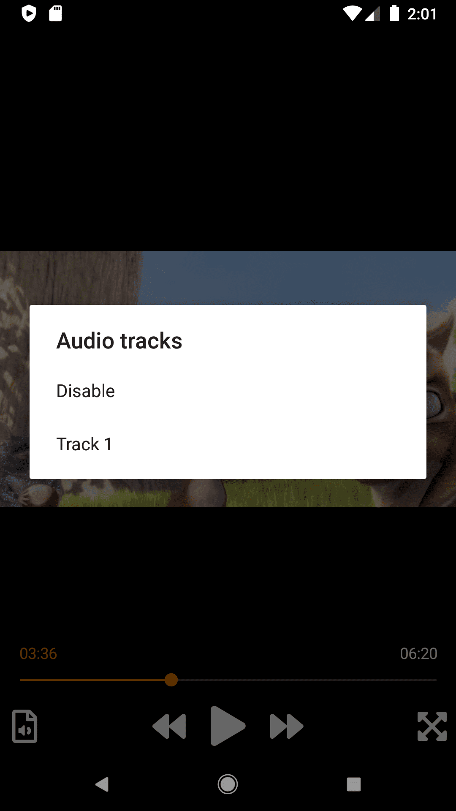

## How to use the MediaElement control ?

```xaml
<vlc:MediaPlayerElement
    EnableRendererDiscovery="True"
    LibVLC="{Binding LibVLC}"
    MediaPlayer="{Binding MediaPlayer}" />
```

Without customization, the view look like VLC Android or iOS UI.

|  |  |
| ------------------------------------------------------------ | ------------------------------------------------------------ |


